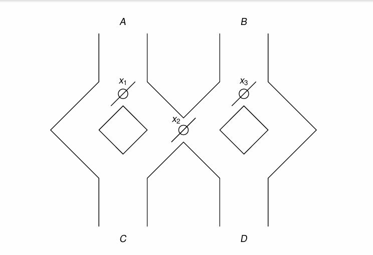

# 2025春季学期计算理论基础期末考试试卷（回忆版）

## 注：这次考试的形式是五道题自行选四个做，每题25分，多做没有加分；此外，原卷面是英文，请大家注意

1.给出接受以下语言的DFA：
所有以1开头，能被5整除的二进制串，如101, 1010, 1111，左侧（自动机读入的第一个符号）为最高位，右侧为最低位

2.请给出DFA化简中State Elimination Technique的复杂度的tight bound，要有明确的推理过程

3.A marble is dropped at A and B. Levers x1, x2 and x3 cause the marble tofall either to the left or to the right. Whenever a marble encounters a lever, it causes the lever to reverse after the marble passes, so the next marble will take the opposite branch. The game wins when there is a marble falls through C. The levers are all initialized to the left. Model this toy by a DFA.

4.证明语言 $L = \{a^nb^nc^md^m (n \geq m \geq 1) \cup a^nb^mc^md^n (n \geq m \geq 1)\}$ 不是CFL

5.构造如下的图灵机，其功能为：给定三个非负整数n, m, k，判断n + m是否等于k。

输入的形式为：$$\underbrace{11……1}_{n个}0\underbrace{11……1}_{m个}0\underbrace{11……1}_{k个}$$
